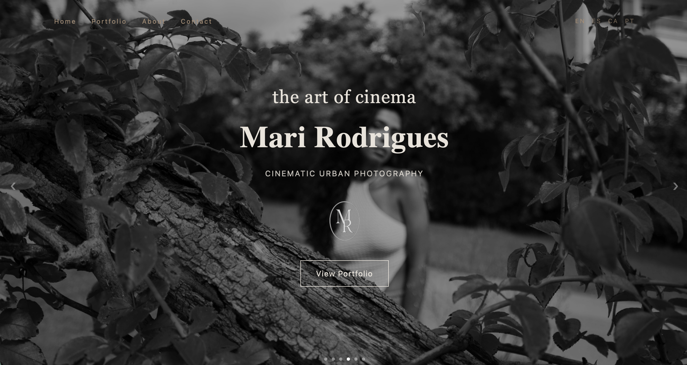
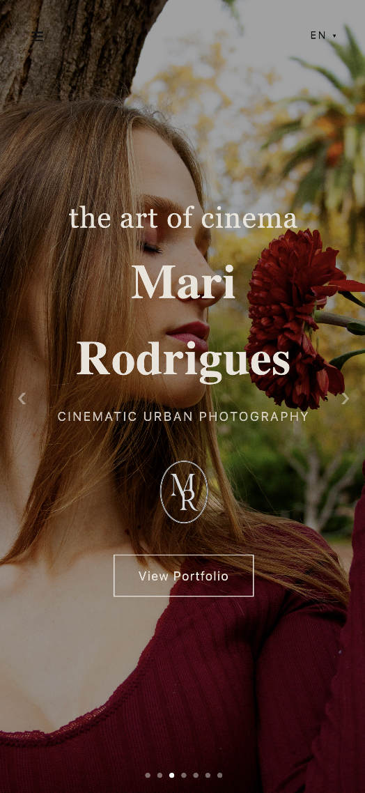
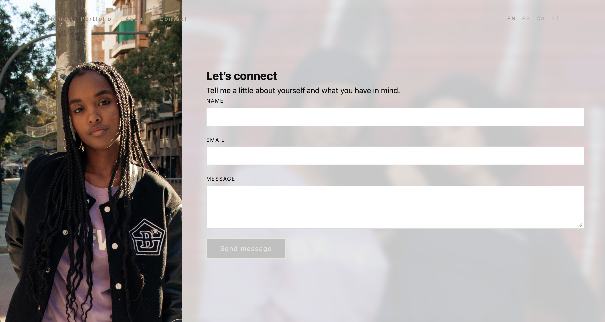

# Marina Rodrii Photo | Cinematic Photography


Official website for photographer Marina Rodrigues, focused on cinematic photography, emotional storytelling, and a clean visual experience.

This project was rebuilt from scratch using React to provide a faster, more modern, and scalable experience. The current version focuses on performance, responsiveness, and maintainable component-based architecture, while leaving room for future backend integration and content management features.

---

# Project Overview

The website was designed to showcase Marina Rodrigues' portfolio through an elegant and immersive browsing experience.

Main goals:

- Clean and minimalist design
- Cinematic visual storytelling
- Responsive experience across all devices
- Component-based architecture
- Easy future scalability

---

# Screenshots

## Desktop — Home



## Mobile — Home



## Portfolio


## Contact



---

# Tech Stack

## Frontend

- React
- Vite
- JavaScript (ES6+)
- CSS3

## Deployment

- Vercel

---

# Application Architecture

The project follows a component-based architecture to keep the code modular and easy to maintain.

```
src/
│
├── assets/
├── components/
├── sections/
├── locales/
├── hooks/
├── utils/
└── App.jsx
```

The application also includes:

- Reusable UI components
- Multi-language support
- Responsive layouts
- Centralized styling
- Clean folder organization

---

# Features

- Responsive design
- Smooth scrolling navigation
- Photography portfolio
- WhatsApp contact integration
- Multi-language support
  - Portuguese
  - English
  - Spanish
  - Catalan
- Optimized image loading
- Modern React architecture

---

# Running the Project Locally

```bash
git clone https://github.com/lorenasferreira/marinarodriiphoto.git

cd marinarodriiphoto

npm install

npm run dev
```

---

# Live Website

https://marinarodriiphoto.com

---

# Future Improvements

- Admin dashboard
- Authentication system
- Portfolio management panel
- Cloudinary image uploads
- Backend API
- PostgreSQL database integration
- SEO improvements
- Image lazy loading optimizations
- Analytics dashboard

---

# Code Quality

- Reusable React components
- Clean folder structure
- Responsive-first development
- Maintainable architecture
- Scalable project organization

---

# Author

Website designed and developed by **Lorena Ferreira**

Portfolio:
https://lorenaferreira.dev